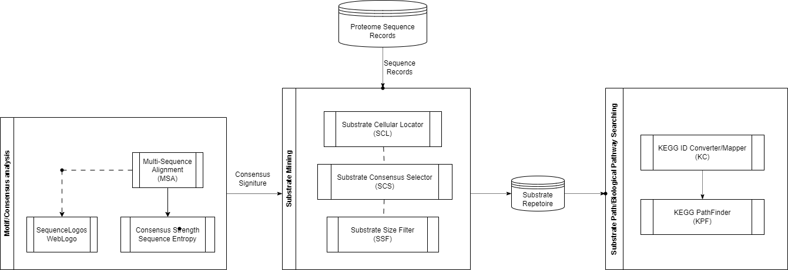
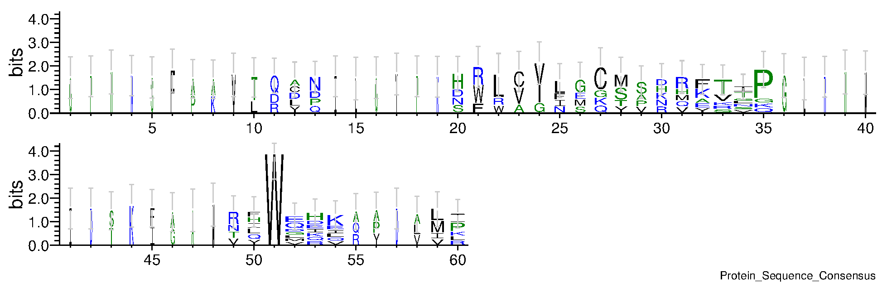

# Summary
`Substrateminer` is a Python library that provides a suite of modular investigative methods based on protein sequence and cellular properties to support rapid development of *in silico* pipelines to discover and interrogate potential substrates for a target protease of interest. Three categories of methods are included in `substrateminer`: consensus analysis, substrate mining, and pathological investigation. Together, they provide a well-suited toolkit to explore substrate repertoires, also known as the substrate degradome, for a target protease.

# Statement of need
The ability to identify and discover novel protease *in situ* substrates is often a powerful first step towards understanding the biological functions of proteases and their implications in human health and disease. However, in traditional enzymology, substrates of a target enzyme are studied one at a time, arguably due to prohibitive cost involved in designing and deploying large-scale experimental assays. Modern proteomics methods, particularly the advancement in mass spectrometry, drastically reduce the cost associated with detecting substrate hydrolysis events at the molecular level, and now the study of substrates of a target enzyme at the proteome level is no longer a distant fantasy. With these new possibilities, the lack of a modular system to enable rapid development of *in silico* pipelines to support preliminary discovery has been a bottleneck for new studies. Therefore, `substrateminer` aims to provide a versatile toolkit that enables fast modular development of *in silico* pipelines to facilitate the preliminary discovery that complement and accelerate the emerging experimental efforts.

# Background
Proteolytic cleavage is a fundamental biochemical process in biology, which underpins many important biological processes that surround us from common food processing and digestion [@campbell2005biology]. Almost all proteolytic processes in nature are catalysed by enzymes, and proteases are such an enzyme class that facilitates the biochemical reaction of cleaving peptide bonds. The inhibition of proteases has been a major intervention strategy in modern clinics to modulate molecular proteolytic processes to treat many physiological conditions including viral infections like HIV, hepatitis-C; metabolic dysfunctions like type-2 diabetes [@Scott2017]; and cancers [@Manasanch2017]. In the wake of the COVID-19 pandemic, proteases have emerged as a major therapeutic target for curbing fatality due to viral infections [@ijms25158105;@v16030366;@ijms22115762].

Nevertheless, one constraining factor that confronts the rapid development of protease inhibitory therapy is the undiscriminating nature of inhibition. This is a major challenge because most proteases are involved in a complex network of biological processes and a complete inhibition of one protease can lead to unintended consequences on many other biological processes. Therefore, identifying and understanding the substrate degradome of a target protease is an important preliminary step towards inhibitory therapy. Traditionally, the identification of protease substrates is often challenging due to the prohibitive cost of large scale deployment of target-designed immuno-based biochemistry assays and scarcity of adequate animal models. Modern advancements in proteomics, particularly the maturation of mass spectrometry [@HAN2008483] and soft-ionisation methods [@Challen202100394], started to become a cost effective alternative in identification of protease substrates at a proteome level. Therefore, the ability to rapidly develop *in silico* pipelines to support preliminary discovery of protease substrates is increasingly needed to complement the emerging experimental efforts. Here, the introduction of `substrateminer` aims to streamline the modular development of *in silico* pipelines for the preliminary discovery of substrate degradome for a target protease based on cleavage sequence consensus.

# Methods
`Substrateminer` contains three main classes of functions (with a schematic depicted in \autoref{fig:workflow}), namely consensus investigation (via submodules msa and consensus), substrate mining (via submodule miner) and substrate biopathological pathway searching (via submodule pathfinder).

A typical workflow for adopting `substrateminer` to investigate substrate degradome for a given protease often involves the following three main stages:

## Consensus investigation
`Substrateminer` provides a mechanism to visualise the cleavage consensus motif and calculate the strength of conservation at each site along the motif. The strength of conservation is calculated based on entropy, and `substrateminer` is also packaged with auxiliary tools to provide multi-sequence alignment (MSA) access to help prepare the input data for consensus investigation. Consensus visualisation is created by calling an implementation of weblogo [@Crooks01062004]. (\autoref{fig:weblogo})

As of the current release, `substrateminer` supports two popular multi-alignment tools for proteins, namely `MUSCLE` (default) [@gkh340] and `MAFFT` [@gkf436], while the Linux distribution supports additional implementation of `ClustalO` [@bi0313s48]. The cleavage motif consensus is calculated based on the frequency of amino acid residues at each position along the motif and the visualisation is proportional to the information content at each site. The information content $R$ at position $i$ for protein is defined by \autoref{eq:information_content}:

\begin{equation}\label{eq:information_content}
R_i = -\log_2(20) - H(X_i)
\end{equation}

The strength of conservation is calculated based on Shannon entropy [@Shannon6773024] with the formulation in \autoref{eq:entropy}, and the consensus motif is defined as the most frequent amino acid residue at each position along the motif.

\begin{equation}\label{eq:entropy}
H(X) = -\sum_{i=1}^{n} p_i \log_2 p_i
\end{equation}

## Substrate mining
Upon the identification of a cleavage consensus, `substrateminer` provides a mechanism to mine potential substrates based on three filter strategies:

1. _Cellular location_: filter potential substrates based on the cellular localisation of the intended target. For example, if the target protease is a secreted protease, the substrates mined should be extracellular proteins.
2. _Target Size_: filter potential substrates based on the size of the intended target. For example, if the target substrate is a small protease, the substrates mined should be small proteins or peptides of a specified size.
3. _Consensus_: filter potential substrates based on the conservation of the cleavage consensus. In the current release, both intra-protein cleavage (i.e., endopeptidase) and terminal cleavage (both C and N-terminal) (i.e., exopeptidase) consensus are supported.

## Substrate pathobiological pathway searching
To further investigate the pathobiological relevance of novel substrates, `substrateminer` implements a search strategy to retrieve known biological processes and disease associations based on the _de facto_ standard KEGG database [@10.1093;@pro3715]. In the present release, the `pathfinder` module in the `substrateminer` provides three main functions, namely KEGG accession conversion, biological processes tracing and human disease mapping, where KEGG accession conversion enables a gateway to KEGG databases where further information including enzyme nomenclature and disease-related network databases can be easily accessed.  Biological processes tracing allows users to trace the biological processes associated with a given substrate, and human disease mapping enables users to map the potential substrates to known human diseases based on the KEGG disease database.

As of the current release, the `pathfinder` submodule queries all 580 KEGG molecular pathway maps and covers 1205 eukaryotes, 9375 bacteria and 449 archaea [@kegg_statistics_2025]. Nevertheless, the diseases covered are limited to the human context.

# Limitations
The current release of `substrateminer` is limited to the investigation of protease substrates based on substrate primary sequence consensus in model organisms. In cases where proteases have very loose consensus, like metalloproteinase ADAM10 [@CaescuBJ20090549] that is arguably best-known for its protective effects in prion diseases like mad cow in cattle, additional structural factors and contexts may need to be taken into consideration. Additionally, the efficacy of the `substrateminer` investigative power expanding beyond well-studied organisms is limited by the availability of a comprehensive proteome database for the underlying species. In the future, we aim to expand the scope of `substrateminer` to scrutinise substrate structural characteristics and provide a more comprehensive suite of tools for substrate investigation.

# Conflict of Interests
The author declares no conflict of interest.

# References