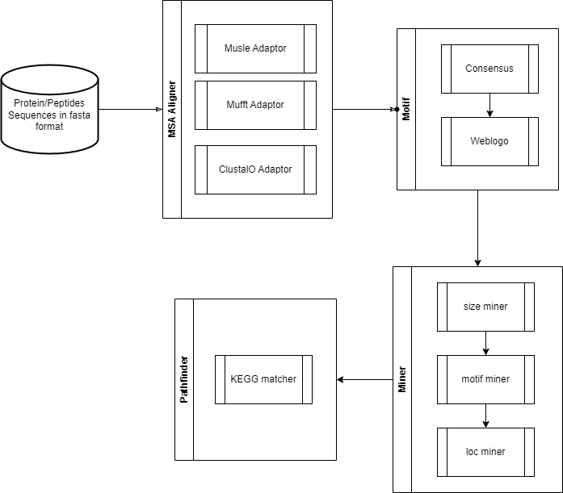

`substrateminer` is designed to provide a suite of methods to investigate enzyme substrate repertorie based on sequence cleavage consensus. The package is modular and extensible and can be used to design custom workflows. The following demonstrates a typical workflow:

